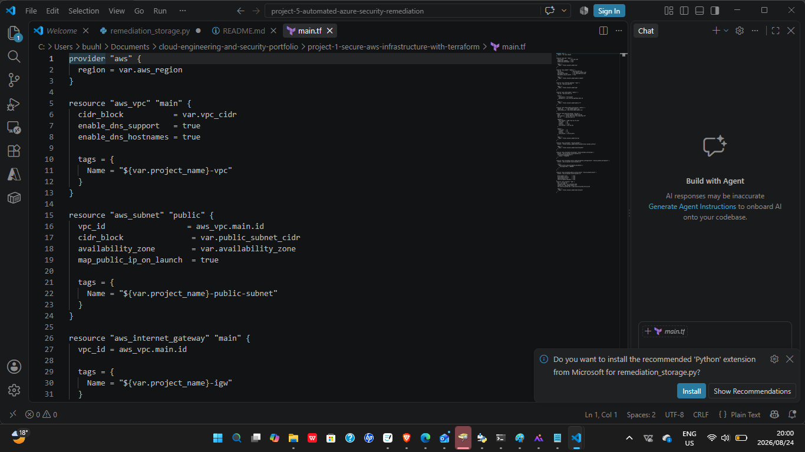
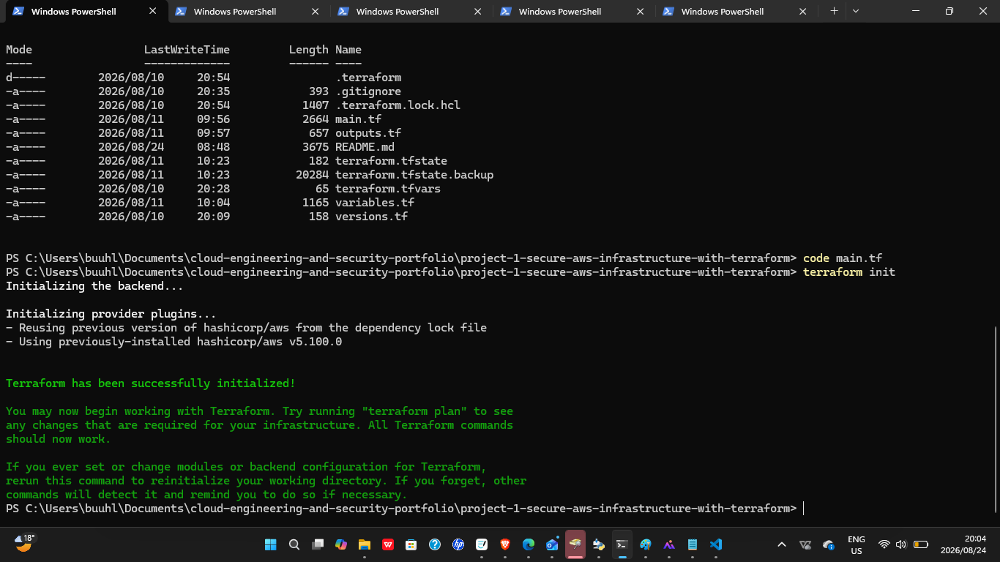
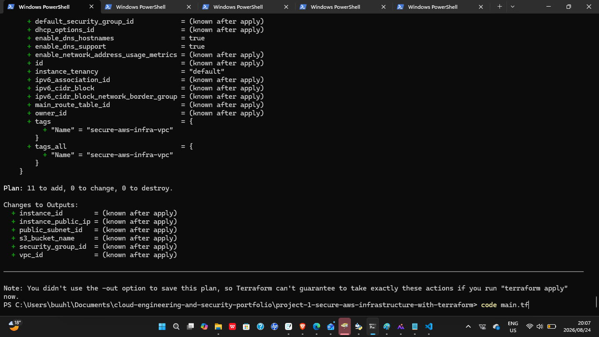
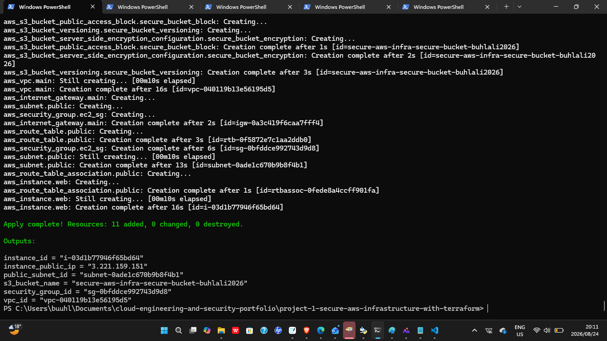
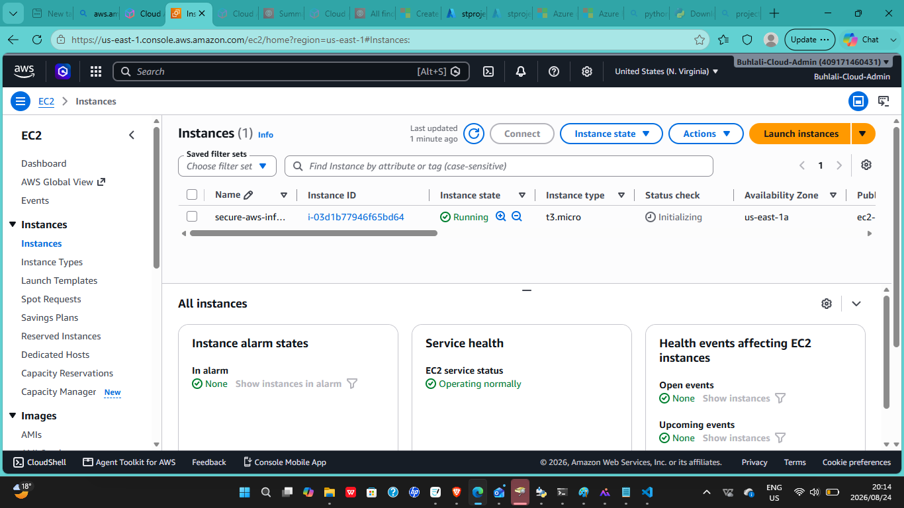

# 01 — Secure AWS Cloud Infrastructure with Terraform

## Overview

This project demonstrates the deployment and security of foundational AWS cloud infrastructure using **Terraform as Infrastructure as Code (IaC)**.

The environment focuses on cloud networking, compute, identity and access management, secure storage, logging, and infrastructure automation.

The goal was to build AWS infrastructure in a way that is **repeatable, secure, documented, and manageable through code**.

---

## Technologies Used

- Amazon Web Services (AWS)
- Terraform
- Amazon VPC
- Amazon EC2
- AWS Identity and Access Management (IAM)
- Amazon S3
- AWS CloudTrail
- Security Groups
- Git
- GitHub

---

## Objectives

- Provision AWS resources using Terraform
- Create and configure an Amazon VPC
- Configure network subnets
- Deploy Amazon EC2 resources
- Configure Security Groups
- Configure IAM roles and permissions
- Configure secure Amazon S3 storage
- Enable AWS CloudTrail logging
- Apply cloud security controls
- Validate the Terraform configuration
- Verify the deployed AWS infrastructure

---

## Infrastructure as Code

Terraform was used as the primary **Infrastructure as Code** tool for defining and provisioning the AWS environment.

Instead of relying only on manual configuration through the AWS Management Console, cloud resources were defined through Terraform configuration files.

This approach demonstrates:

- Declarative infrastructure
- Automated cloud provisioning
- Reproducible deployments
- Consistent resource configuration
- Infrastructure validation
- Version-controlled infrastructure
- Reduced manual configuration

---

## Terraform Workflow

The infrastructure was deployed using the standard Terraform workflow:

```bash
terraform init
terraform validate
terraform plan
terraform apply
```

### Workflow Purpose

- `terraform init` — initializes the Terraform working directory and required providers
- `terraform validate` — checks the Terraform configuration for syntax and configuration errors
- `terraform plan` — previews the infrastructure changes Terraform will make
- `terraform apply` — provisions the defined AWS infrastructure

---

## Architecture

The environment combines Terraform-based provisioning with AWS networking, compute, storage, identity, and logging services.

```text
                    Terraform
                        |
                        v
               AWS Infrastructure
                        |
                        v
                  Amazon VPC
                        |
              +---------+---------+
              | |
              v v
           Subnets Security Groups
              | |
              +---------+---------+
                        |
                        v
                   Amazon EC2
                        |
              +---------+---------+
              | |
              v v
          Amazon S3 AWS CloudTrail
              | |
              v v
        Secure Storage Logging & Auditing
```

### Architecture Components

- **Terraform** — defines and provisions the AWS infrastructure
- **Amazon VPC** — provides an isolated cloud network
- **Subnets** — organize resources within the VPC
- **Security Groups** — control inbound and outbound network traffic
- **Amazon EC2** — provides compute resources
- **Amazon S3** — provides secure cloud storage
- **AWS IAM** — manages identity, roles, and access permissions
- **AWS CloudTrail** — records AWS API activity for logging, auditing, and security investigations

---

## Implementation

### Networking

An Amazon Virtual Private Cloud (VPC) was configured to provide an isolated AWS network environment.

Subnets were used to organize resources within the VPC and support network segmentation.

Security Groups were configured to control inbound and outbound traffic to the deployed resources.

---

### Compute

Amazon EC2 resources were deployed within the configured AWS network.

The instances were placed inside the VPC and protected using Security Groups to reduce unnecessary network exposure.

---

### Identity and Access Management

AWS IAM roles and permissions were configured to control access to AWS services and resources.

The environment was designed around the principle of **least privilege**, allowing only the permissions required for the relevant resources and operations.

---

### Secure Storage

Amazon S3 was configured to provide cloud storage with security controls applied.

Security considerations included:

- Restricted public access
- Controlled permissions
- Encryption
- Secure resource access
- Reduced risk of accidental data exposure

---

### Logging and Auditing

AWS CloudTrail was enabled to record AWS API activity within the environment.

CloudTrail provides visibility into actions performed within the AWS account and supports:

- Security investigations
- Auditing
- Activity tracking
- Operational visibility
- Change monitoring

---

## Security Controls

The environment demonstrates the following cloud security practices:

- Least-privilege IAM permissions
- Restricted Security Group rules
- Network segmentation
- Controlled cloud resource access
- Secure Amazon S3 configuration
- Restricted public access
- Encryption
- AWS CloudTrail auditing
- Infrastructure managed through Terraform
- Repeatable infrastructure deployment

---

## Validation

The Terraform configuration was validated and deployed using the standard workflow:

```bash
terraform init
terraform plan
terraform apply
```

After deployment, the AWS environment was reviewed to confirm that the required infrastructure had been successfully created and configured.

Validation included:

- Successful `terraform init` (backend and provider plugins initialized)
- `terraform plan` output confirming 11 resources to add, 0 to change, 0 to destroy
- Successful `terraform apply` — 11 resources added, 0 changed, 0 destroyed
- Verification of the deployed EC2 instance in the AWS Console (state: Running)
- Verification of VPC, subnet, security group, and S3 bucket creation via Terraform outputs
- Clean teardown confirmed via `terraform destroy` — 11 resources destroyed

### Apply Output

```text
Apply complete! Resources: 11 added, 0 changed, 0 destroyed.

Outputs:

instance_id = "i-03d1b77946f65bd64"
instance_public_ip = "3.221.159.151"
public_subnet_id = "subnet-0ade1c670b9b8f4b1"
s3_bucket_name = "secure-aws-infra-secure-bucket-buhlali2026"
security_group_id = "sg-0bfddce992743d9d8"
vpc_id = "vpc-040119b13e56195d5"
```

### Destroy Output

```text
Destroy complete! Resources: 11 destroyed.
```

---

## Troubleshooting

During implementation, configuration and deployment issues were investigated by reviewing:

- Terraform configuration files
- Terraform validation output
- Terraform plan output
- Terraform apply output
- Security Group rules
- Subnet configuration
- Network routing
- IAM permissions
- AWS resource configuration
- CloudTrail activity

This troubleshooting process helped confirm that the infrastructure was deployed correctly and that the required security controls were functioning as expected.

---

## Screenshots

### Terraform Configuration





### Terraform Initialization





### Terraform Plan





### Terraform Apply





### Deployed AWS Infrastructure





---

## Skills Demonstrated

- AWS Cloud Engineering
- Terraform
- Infrastructure as Code
- Automated Infrastructure Provisioning
- Amazon VPC
- Amazon EC2
- AWS IAM
- Amazon S3
- AWS CloudTrail
- Cloud Networking
- Network Segmentation
- Cloud Security
- Secure Cloud Storage
- Security Groups
- Logging and Auditing
- Infrastructure Validation
- Troubleshooting
- Git
- GitHub
- Technical Documentation

---

## Key Engineering Concepts

- Infrastructure as Code
- Declarative infrastructure
- Reproducible deployments
- Automated provisioning
- Version-controlled infrastructure
- Least-privilege access
- Network segmentation
- Secure-by-design infrastructure
- Cloud logging
- Infrastructure validation
- Security auditing

---

## Repository Structure

```text
project-1-secure-aws-infrastructure-with-terraform/
├── README.md
├── main.tf
├── variables.tf
├── outputs.tf
├── versions.tf
├── .gitignore
└── screenshots/
```

---

## Future Improvements

Potential future improvements include:

- Refactor the Terraform configuration into reusable modules
- Configure remote Terraform state
- Add Terraform state locking
- Add CI/CD integration
- Add automated Terraform validation
- Add Terraform security scanning
- Add enhanced monitoring and alerting
- Add additional network security controls
- Add automated policy validation
- Add automated compliance checks
- Add cost monitoring and optimization