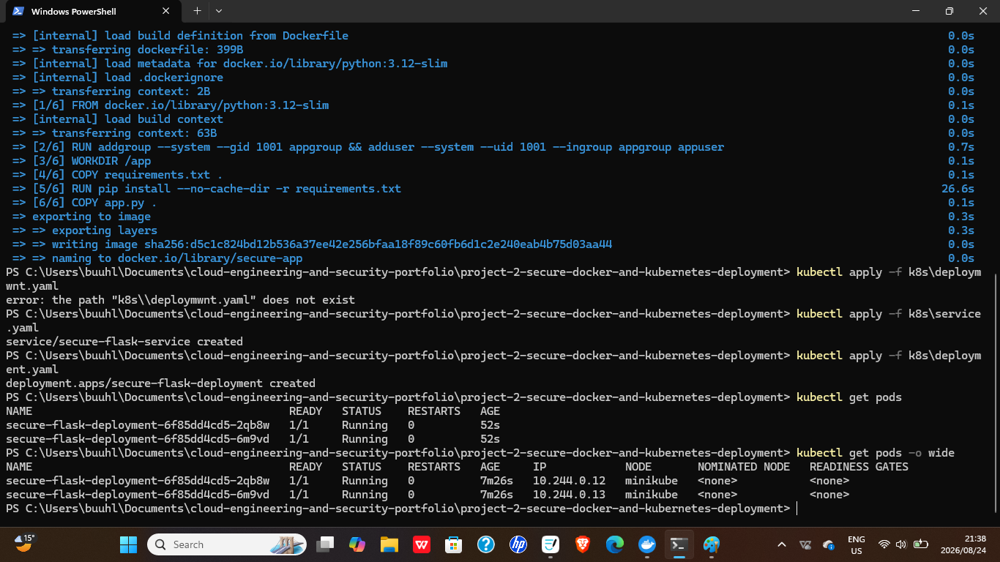
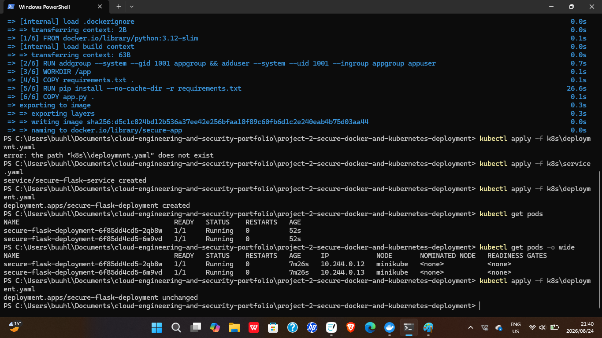
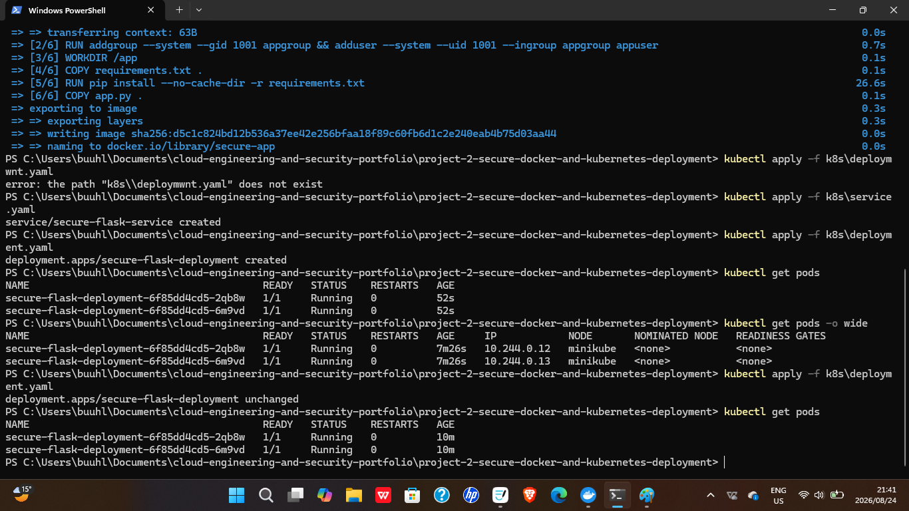
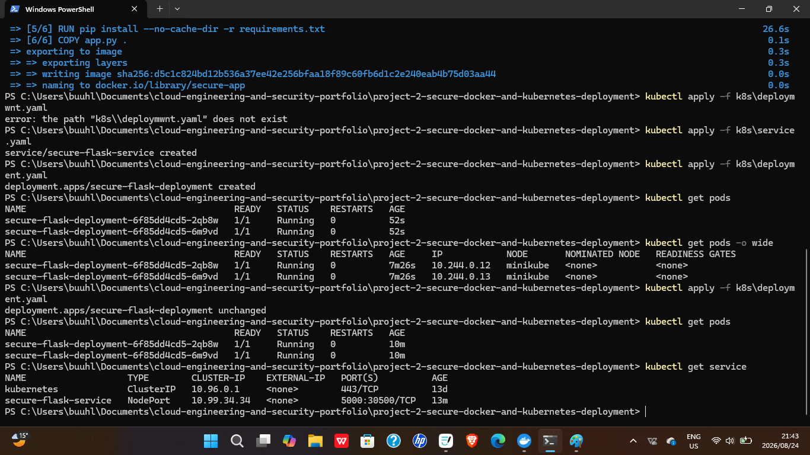

# 02 — Secure Docker & Kubernetes Deployment

## Overview

This project demonstrates the containerization and orchestration of an application using **Docker and Kubernetes**.

The environment focuses on application packaging, container deployment, Kubernetes workload management, health monitoring, configuration management, resource controls, and container security.

The goal was to deploy an application in a way that is **portable, reproducible, secure, observable, and manageable through container orchestration**.

---

## Technologies Used

- Docker
- Kubernetes
- Minikube
- Python
- kubectl
- Docker CLI
- Kubernetes Deployments
- Kubernetes Services
- ConfigMaps
- Secrets
- Liveness Probes
- Readiness Probes
- Git
- GitHub

---

## Objectives

- Containerize an application using Docker
- Build and run a Docker image
- Deploy the application into Kubernetes
- Configure Kubernetes Deployments
- Expose the application using a Kubernetes Service
- Configure application settings using ConfigMaps
- Manage sensitive configuration using Kubernetes Secrets
- Configure liveness probes
- Configure readiness probes
- Apply CPU and memory resource limits
- Run the container using a non-root security context
- Validate pod health and application availability
- Demonstrate secure container deployment practices

---

## Containerization

Docker was used to package the application and its dependencies into a portable container image.

Instead of depending on the configuration of the local operating system, the application was packaged with the components required to run consistently across environments.

This approach demonstrates:

- Portable application packaging
- Consistent runtime environments
- Application isolation
- Reproducible deployments
- Version-controlled container configuration
- Reduced environment-specific configuration
- Simplified application deployment

---

## Docker Workflow

The application was containerized using the standard Docker workflow:

```bash
docker build -t secure-app .
docker run secure-app
docker ps
```

### Workflow Purpose

- `docker build` — creates a Docker image from the Dockerfile
- `docker run` — starts a container from the built image
- `docker ps` — verifies that the container is running

The container was tested locally before being deployed into Kubernetes.

---

## Kubernetes Orchestration

Kubernetes was used to manage the containerized application after the Docker image was created.

The workload was defined using declarative Kubernetes configuration files rather than relying on manual container management.

This approach demonstrates:

- Declarative workload configuration
- Container orchestration
- Automated workload management
- Application availability
- Configuration separation
- Resource management
- Health monitoring
- Secure workload execution

---

## Kubernetes Workflow

The workload was deployed using Kubernetes commands such as:

```bash
kubectl apply -f k8s/deployment.yaml
kubectl apply -f k8s/service.yaml
kubectl get pods
kubectl get deployments
kubectl get services
```

### Workflow Purpose

- `kubectl apply` — creates or updates Kubernetes resources from configuration files
- `kubectl get pods` — verifies that application pods are running
- `kubectl get deployments` — verifies the deployment state
- `kubectl get services` — confirms that the application service is available

---

## Architecture

The environment combines Docker containerization with Kubernetes orchestration and security controls.

```text
                 Application Source Code
                          |
                          v
                      Dockerfile
                          |
                          v
                    Docker Image
                          |
                          v
                       Minikube
                          |
                          v
                     Kubernetes
                          |
               +----------+----------+
               | |
               v v
          Deployment Service
               |
               v
              Pods
               |
      +--------+--------+
      | |
      v v
  ConfigMap Secret
      | |
      +--------+--------+
               |
               v
        Application Config
               |
               v
     Health & Resource Controls
               |
      +--------+--------+
      | |
      v v
Liveness Probe Readiness Probe
               |
               v
      Secure Application Runtime
```

### Architecture Components

- **Application Source Code** — contains the application logic
- **Dockerfile** — defines how the application image is built
- **Docker Image** — packages the application and required dependencies
- **Minikube** — provides the local Kubernetes cluster
- **Kubernetes Deployment** — manages pods and desired application state
- **Kubernetes Service** — provides network access to the application
- **Pods** — run the application containers
- **ConfigMap** — stores non-sensitive application configuration
- **Secret** — stores sensitive application configuration
- **Liveness Probe** — checks whether the application remains healthy
- **Readiness Probe** — checks whether the application is ready to receive traffic
- **Resource Controls** — limit CPU and memory consumption
- **Security Context** — reduces container privileges

---

## Implementation

### Docker Image

The application was packaged into a Docker image using a Dockerfile.

The Dockerfile defines a non-root system user (`appuser`, UID 1001) to run the application, installs dependencies from `requirements.txt`, copies the application source, exposes port 5000, and runs the app via `CMD ["python", "app.py"]`.

---

### Kubernetes Deployment

A Kubernetes Deployment was configured to manage the application workload.

The Deployment defines:

- Container image
- Number of replicas
- Environment configuration
- Health checks
- Resource requests and limits
- Security settings

Kubernetes maintains the desired application state and recreates failed pods when necessary.

---

### Kubernetes Service

A Kubernetes Service was configured to provide stable network access to the deployed application.

The Service allows traffic to reach the application pods without depending directly on changing pod IP addresses.

---

### ConfigMaps

ConfigMaps were used to separate non-sensitive configuration from the application container image.

This allows application settings to be updated without rebuilding the container image.

---

### Secrets

Kubernetes Secrets were used to manage sensitive configuration separately from the application source code.

This helps reduce the risk of storing sensitive values directly inside container images or application files.

---

### Health Monitoring

Liveness and readiness probes were configured to monitor application health.

The liveness probe helps Kubernetes determine whether the application needs to be restarted.

The readiness probe determines whether the application is ready to receive network traffic.

---

### Resource Management

CPU and memory resource settings were applied to the container workload.

Resource controls help:

- Prevent excessive resource consumption
- Improve workload stability
- Support predictable scheduling
- Reduce the impact of misbehaving containers

---

## Security Controls

The environment demonstrates the following container and Kubernetes security practices:

- Non-root container execution
- Kubernetes Secrets for sensitive configuration
- Separation of configuration using ConfigMaps
- CPU and memory resource controls
- Liveness probes
- Readiness probes
- Controlled application exposure through Services
- Declarative workload configuration
- Container isolation
- Reduced container privileges

---

## Validation

The Docker image and Kubernetes workload were validated during deployment.

Validation included:

```bash
docker build -t secure-app .
kubectl apply -f k8s/deployment.yaml
kubectl apply -f k8s/service.yaml
kubectl get pods
kubectl get services
```

After deployment, the environment was reviewed to confirm that the application was running correctly.

Validation included:

- Successful Docker image build (`Successfully built` / `Successfully tagged secure-app:latest`)
- Deployment and Service successfully created (`deployment.apps/secure-flask-deployment created`, `service/secure-flask-service created`)
- Both pods verified in `Running` state (1/1 ready) via `kubectl get pods`
- Pod IPs and node assignment confirmed via `kubectl get pods -o wide`
- Service confirmed active as a NodePort exposing port 5000 (mapped to 30500) via `kubectl get services`

### Service Output

```text
NAME TYPE CLUSTER-IP EXTERNAL-IP PORT(S) AGE
kubernetes ClusterIP 10.96.0.1 <none> 443/TCP 13d
secure-flask-service NodePort 10.99.34.34 <none> 5000:30500/TCP 13m
```

---

## Troubleshooting

During implementation, container and Kubernetes issues were investigated by reviewing:

- Docker build output
- Docker container logs
- Dockerfile configuration
- Kubernetes YAML configuration
- Pod status
- Deployment status
- Service configuration
- Container logs
- Probe failures
- ConfigMap values
- Secret references
- Resource configuration

Useful troubleshooting commands include:

```bash
docker logs <container-name>
kubectl get pods
kubectl describe pod <pod-name>
kubectl logs <pod-name>
kubectl get services
kubectl describe deployment <deployment-name>
```

Issues encountered and resolved during this session included a temporarily stopped Minikube cluster (resolved with `minikube start --driver=docker`) and a Docker Desktop credential/paging file error during image build (resolved by setting `DOCKER_BUILDKIT=0` to use the legacy builder).

This troubleshooting process helped verify that the container and Kubernetes resources were configured and operating correctly.

---

## Screenshots

### Docker Image Build


### Running Container





### Kubernetes Deployment





### Running Kubernetes Pods





### Kubernetes Service





---

## Skills Demonstrated

- Docker
- Kubernetes
- Minikube
- Containerization
- Container Orchestration
- Kubernetes Deployments
- Kubernetes Services
- ConfigMaps
- Kubernetes Secrets
- Liveness Probes
- Readiness Probes
- Resource Management
- Container Security
- Application Deployment
- Workload Configuration
- Troubleshooting
- Git
- GitHub
- Technical Documentation

---

## Key Engineering Concepts

- Containerization
- Portable application deployment
- Declarative workload configuration
- Container orchestration
- Configuration separation
- Application health monitoring
- Resource management
- Non-root execution
- Secure container configuration
- Application availability
- Reproducible deployment
- Kubernetes workload management

---

## Repository Structure

```text
project-2-secure-docker-and-kubernetes-deployment/
├── README.md
├── Dockerfile
├── app.py
├── requirements.txt
├── k8s/
│ ├── deployment.yaml
│ └── service.yaml
└── screenshots/
```

---

## Future Improvements

Potential future improvements include:

- Deploy the workload to a managed Kubernetes service
- Add Horizontal Pod Autoscaling
- Add Kubernetes Network Policies
- Add an Ingress Controller
- Add TLS encryption
- Add image vulnerability scanning
- Add container image signing
- Add centralized logging
- Add application monitoring
- Add CI/CD integration
- Add automated Kubernetes validation
- Add Helm charts
- Add secrets management using a dedicated secrets platform
- Provision Kubernetes infrastructure using Terraform