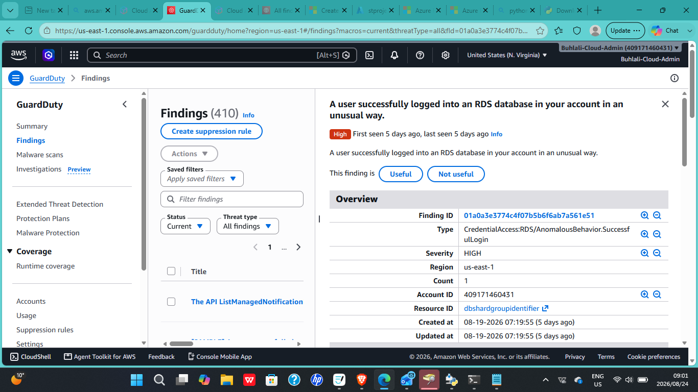
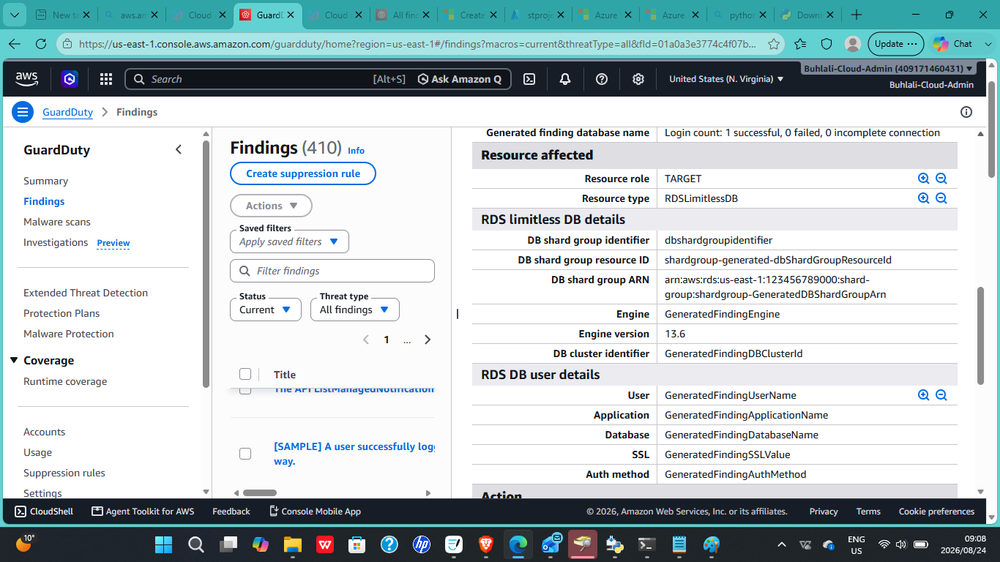
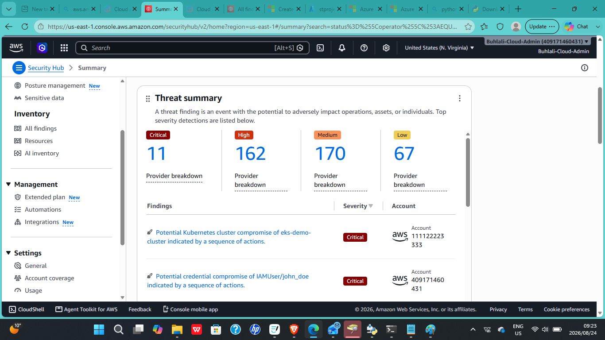
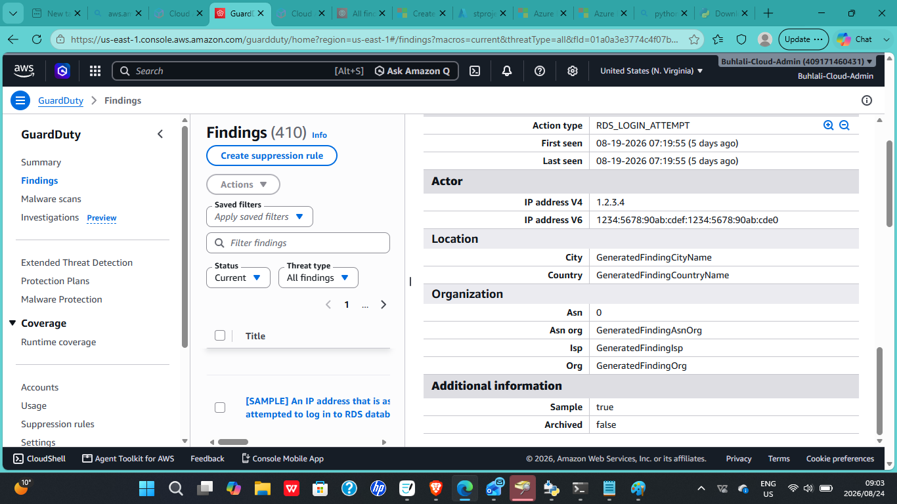

# 03 — AWS SOC Security Monitoring & Incident Investigation

## Overview

This project demonstrates a structured SOC-style cloud security investigation within an Amazon Web Services (AWS) environment.

The investigation focused on an anomalous successful login to an Amazon RDS database using an Amazon GuardDuty sample finding.

The finding was used to validate the detection pipeline between Amazon GuardDuty and AWS Security Hub, and to demonstrate the workflow of reviewing, investigating, assessing, and documenting a cloud security incident.

The goal was to demonstrate practical skills in security monitoring, threat detection, incident triage, investigation, impact assessment, and incident response documentation.

## Technologies Used

- Amazon Web Services (AWS)
- Amazon GuardDuty
- AWS Security Hub
- Amazon RDS
- AWS CloudTrail
- AWS Identity and Access Management (IAM)
- AWS Security Groups
- Git
- GitHub
- Markdown

## Objectives

- Review an Amazon GuardDuty security finding
- Investigate an anomalous successful RDS login
- Identify the affected AWS resource
- Review finding severity and technical details
- Confirm GuardDuty findings propagate into AWS Security Hub
- Validate that cloud security monitoring is functioning
- Assess the potential impact of the finding
- Identify appropriate containment and remediation actions
- Document the investigation process
- Demonstrate a structured SOC incident investigation workflow

## Incident Response Workflow

    Amazon GuardDuty
           |
           v
    Security Finding Generated
           |
           v
    Finding Review
           |
           v
    Affected RDS Resource Identified
           |
           v
    Security Hub Validation
           |
           v
    Incident Investigation
           |
           v
    Impact Assessment
           |
           v
    Response Recommendations
           |
           v
    Incident Documentation

### Workflow Purpose

- GuardDuty Detection — identifies suspicious or anomalous activity
- Finding Review — reviews finding type, severity, resource, and event details
- Resource Identification — identifies the affected Amazon RDS resource
- Security Hub Validation — confirms the finding appears in AWS Security Hub
- Incident Investigation — analyzes the finding and supporting evidence
- Impact Assessment — evaluates potential security consequences
- Response Recommendations — identifies containment and remediation actions
- Incident Documentation — records the investigation and outcome

## Architecture

The environment uses AWS-native security services to detect, centralize, investigate, and document suspicious activity affecting an Amazon RDS resource.

                    AWS Environment
                          |
                          v
                     Amazon RDS
                          |
                          v
               Anomalous Login Activity
                          |
                          v
                  Amazon GuardDuty
                          |
                          v
                   Security Finding
                          |
                          v
                  AWS Security Hub
                          |
                          v
                Finding Review and Triage
                          |
                          v
                 Incident Investigation
                          |
             AWS CloudTrail Activity Review AWS IAM Identity Review
                          |
                          v
                   Impact Assessment
                          |
                          v
                Response Recommendations
                          |
                          v
                  Incident Report

## Incident Summary

Finding Type: CredentialAccess:RDS/AnomalousBehavior.SuccessfulLogin
Finding ID: 01a0a3e3774c4f07b5b6f6ab7a561e51
Severity: High
Detection Source: Amazon GuardDuty
Region: us-east-1
Resource Affected: RDS shard group, RDSLimitlessDB
Action Type: RDS_LOGIN_ATTEMPT
First Seen: 2026-08-19 07:19:55 UTC
Last Seen: 2026-08-19 07:19:55 UTC
Login Result: 1 successful, 0 failed, 0 incomplete connections
Finding Nature: Sample finding

## What the Finding Means

A valid login succeeded against an Amazon RDS database, but the login behavior differed from the established access baseline.

GuardDuty therefore classified the event as anomalous rather than treating it as a normal authentication event.

A failed login may indicate an unsuccessful attempt, while a successful anomalous login may indicate:

- Compromised credentials
- Unauthorized use of valid credentials
- Unexpected access from a new location or source
- Abnormal authentication behavior
- Potential credential misuse

Because this was a GuardDuty sample finding, the event was used for testing and investigation rather than representing a real compromise.

## Investigation

1. Opened the security finding directly in Amazon GuardDuty
2. Reviewed the full finding details
3. Confirmed the finding type and severity
4. Identified the affected Amazon RDS resource
5. Reviewed actor information such as source IP, ASN, and location fields
6. Reviewed the action type and login result
7. Confirmed GuardDuty and Security Hub integration was active; this specific sample finding was not individually forwarded into Security Hub, which is expected behavior for GuardDuty sample findings
8. Confirmed this behaviour is consistent with GuardDuty's documented handling of sample findings
9. Confirmed that GuardDuty monitoring was active and generating findings
10. Verified that the finding contained the Sample:true flag

## Detection Pipeline Validation

    Amazon RDS Activity
            |
            v
    Amazon GuardDuty
            |
            v
    Security Finding
            |
            v
    AWS Security Hub
            |
            v
    SOC Investigation

The finding was successfully generated in GuardDuty. GuardDuty and Security Hub integration was confirmed active and aggregating findings account-wide, though this specific sample finding did not individually propagate into Security Hub, consistent with expected GuardDuty sample finding behavior.

## Impact Assessment

Because the finding was confirmed as sample data, there was no real production impact.

If the finding had represented a real event, the potential impact could include:

- Unauthorized access to the Amazon RDS database
- Exposure of data stored in the database
- Use of compromised credentials
- Unauthorized database activity
- Potential lateral movement if the same credentials were reused
- Further compromise of connected resources

## Recommended Response

- Rotate the affected RDS database credentials immediately
- Restrict the RDS Security Group to known and expected source IP ranges
- Review AWS CloudTrail activity around the time of the login
- Investigate the source of the credential usage
- Review AWS IAM to identify the associated identity or role
- Assess whether the identity has excessive permissions
- Temporarily disable or restrict the identity if compromise is suspected
- Review additional RDS activity
- Continue monitoring for related GuardDuty findings
- Investigate whether the same credentials were used elsewhere

## Security Controls Demonstrated

- Cloud threat detection
- Security finding triage
- AWS security monitoring
- Centralized security findings
- Identity investigation
- Credential security
- Network access restriction
- AWS activity auditing
- Incident containment
- Security impact assessment
- Incident response planning
- Security documentation

## Incident Report

The detailed investigation is documented separately in INCIDENT-REPORT.md.

[View the Full Incident Report](INCIDENT-REPORT.md)

## Screenshots

### GuardDuty Finding Overview

### RDS Finding Details

### Security Hub Threat Summary

### Sample Finding Confirmation

## Skills Demonstrated

- AWS Cloud Security
- Amazon GuardDuty
- AWS Security Hub
- Amazon RDS Security
- AWS CloudTrail
- AWS IAM
- SOC Monitoring
- Threat Detection
- Security Finding Analysis
- Incident Triage
- Incident Investigation
- Incident Response
- Impact Assessment
- Credential Security
- Security Event Analysis
- Technical Documentation
- Incident Reporting

## Repository Structure

    project-3-aws-soc-security-monitoring-and-incident-investigation/
    README.md
    INCIDENT-REPORT.md
    screenshots/

## Future Improvements

- Add additional GuardDuty investigation scenarios
- Expand AWS CloudTrail event analysis
- Add automated security notifications
- Integrate Amazon EventBridge
- Add automated incident response workflows
- Add Python-based investigation scripts
- Add automated remediation
- Introduce incident severity classification
- Map findings to MITRE ATT&CK techniques
- Expand the environment into a larger AWS SOC monitoring lab
