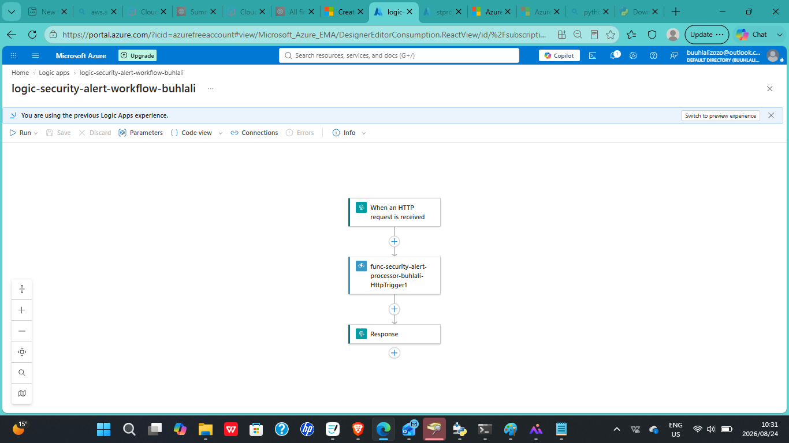
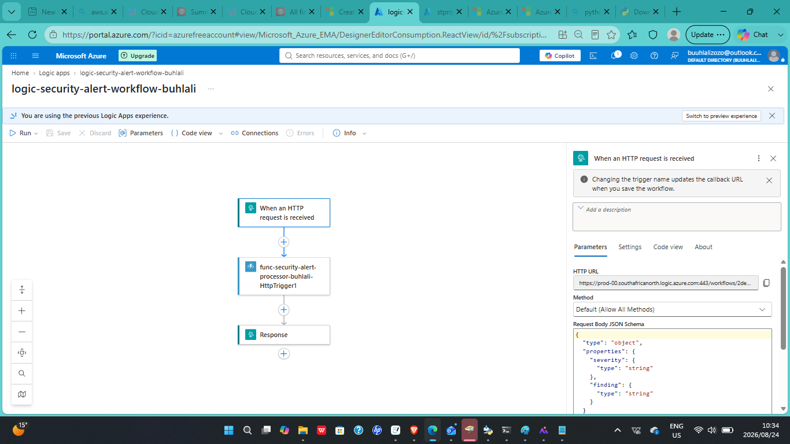
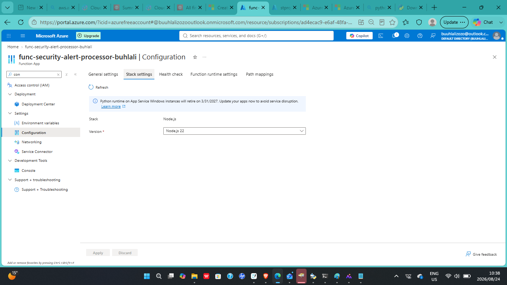
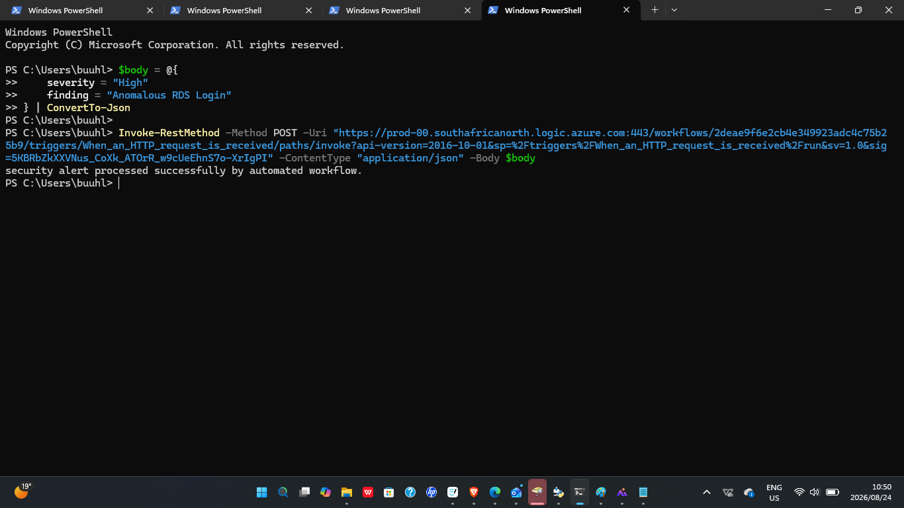
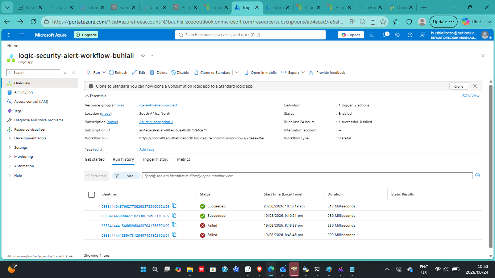

# 04 — Serverless Security Automation with Azure Logic Apps & Functions

## Overview

This project demonstrates a **serverless security automation workflow** built with Microsoft Azure.

The solution receives a simulated security alert through an HTTP request, passes the alert through an Azure Logic App, processes and validates the alert using an Azure Function, and returns a confirmation response.

The project was designed to demonstrate how cloud-native serverless services can support **event-driven security operations, alert processing, workflow orchestration, and security automation** without requiring dedicated server infrastructure.

The goal was to build a lightweight workflow that reflects the type of automation used in modern **SOC and SOAR environments**.

---

## Technologies Used

- Microsoft Azure
- Azure Logic Apps
- Azure Functions
- Azure Portal
- Node.js 22 LTS
- HTTP / REST
- JSON
- PowerShell
- `Invoke-RestMethod`
- Git
- GitHub

---

## Objectives

- Build an event-driven serverless security workflow
- Receive simulated security alerts through an HTTP endpoint
- Configure an Azure Logic App as the workflow orchestrator
- Pass incoming alert data to an Azure Function
- Validate incoming JSON data
- Process security alert fields such as severity and finding
- Log alert information for visibility
- Return a successful confirmation response
- Test the complete workflow end-to-end
- Demonstrate how serverless services can support security operations automation

---

## Serverless Security Automation

The project uses Azure-managed serverless services to automate the processing of security alerts.

Instead of manually receiving and processing each alert, the workflow automatically accepts structured alert data and passes it through a predefined processing pipeline.

This approach demonstrates:

- Event-driven automation
- Serverless computing
- Security workflow orchestration
- Automated alert processing
- HTTP-based service integration
- JSON validation
- Cloud-native security automation
- Reduced infrastructure management

---

## Automation Workflow

The workflow follows the following sequence:

```text
Simulated Security Alert
          |
          v
      HTTP Request
          |
          v
    Azure Logic App
          |
          v
     Azure Function
          |
          v
   Validate JSON Input
          |
          v
    Process Alert Data
          |
          v
      Log Details
          |
          v
 Confirmation Response
```

### Workflow Purpose

- **Simulated Security Alert** — represents an alert that could originate from a security monitoring platform
- **HTTP Request** — sends the structured security alert into the workflow
- **Azure Logic App** — receives the alert and orchestrates the workflow
- **Azure Function** — processes and validates the incoming alert
- **JSON Validation** — confirms required security fields are present
- **Alert Processing** — handles security data such as severity and finding information
- **Logging** — records relevant alert details
- **Confirmation Response** — confirms successful processing of the security alert

---

## Architecture

The architecture combines Azure Logic Apps and Azure Functions to create an event-driven serverless security automation pipeline.

```text
                    Security Alert
                         |
                         v
                   HTTP Request
                         |
                         v
                  Azure Logic App
                         |
              HTTP Request Trigger
                         |
                         v
                Workflow Execution
                         |
                         v
                  Azure Function
                         |
              +----------+----------+
              | |
              v v
        Validate JSON Process Alert
              | |
              +----------+----------+
                         |
                         v
                    Log Details
                         |
                         v
                Return Confirmation
                         |
                         v
                  HTTP Response
```

### Architecture Components

- **Security Alert** — simulated event containing security-related information
- **HTTP Request** — sends the alert into the serverless workflow
- **Azure Logic App** — acts as the workflow trigger and orchestrator
- **HTTP Request Trigger** — starts the Logic App when a request is received
- **Azure Function** — performs custom processing and validation
- **JSON Validation** — checks that required alert fields exist
- **Alert Processing** — processes the incoming security information
- **Logging** — records alert details for visibility and troubleshooting
- **HTTP Response** — confirms that the workflow completed successfully

---

## Azure Function

The Azure Function acts as the processing component of the workflow.

### Configuration

- **Runtime:** Node.js 22 LTS
- **Hosting:** Consumption plan
- **Trigger:** HTTP
- **Authorization:** Function-level authentication key

The function receives the security alert from the Azure Logic App and processes the incoming request.

### Function Responsibilities

The Azure Function:

- Receives the request body from the Logic App
- Validates that the JSON contains required fields
- Checks for security-related fields such as `severity` and `finding`
- Processes the incoming alert information
- Logs relevant alert details
- Returns a confirmation response

---

## Azure Logic App

The Azure Logic App acts as the workflow orchestrator.

The workflow begins when an HTTP request containing a simulated security alert is received.

### Logic App Responsibilities

- Receive the HTTP request
- Validate the incoming request structure against the defined JSON schema
- Pass the request body to the Azure Function
- Wait for the Azure Function to process the alert
- Return a response confirming successful processing

The Logic App allows the workflow to be managed visually while integrating directly with other Azure services.

---

## Alert Data Structure

The workflow processes structured JSON security alerts.

An example request used during testing follows this format:

```json
{
  "severity": "High",
  "finding": "Anomalous RDS Login"
}
```

### Alert Fields

- **severity** — indicates the priority or seriousness of the security event
- **finding** — describes the detected security event

Using structured JSON allows the workflow to receive alerts from different security platforms while maintaining a predictable data format.

---

## Example Request

A test request can be sent to the Logic App HTTP endpoint using PowerShell.

```powershell
$body = @{
    severity = "High"
    finding = "Anomalous RDS Login"
} | ConvertTo-Json

Invoke-RestMethod `
    -Method POST `
    -Uri "<LOGIC-APP-ENDPOINT>" `
    -ContentType "application/json" `
    -Body $body
```

The endpoint should not be committed to the public repository if it contains authentication information or access tokens.

---

## Example Response

After the workflow successfully processes the alert, a confirmation response is returned.

```text
Security alert processed successfully by automated workflow.
```

The response confirms that the alert successfully passed through the automation pipeline.

---

## Security Automation Use Case

This workflow represents a simplified version of how security monitoring platforms can integrate with downstream automation.

A production-style workflow could receive alerts from platforms such as:

- Microsoft Sentinel
- Amazon GuardDuty
- SIEM platforms
- Security monitoring systems
- Cloud-native detection services

The alert could then be forwarded to serverless services for:

- Alert enrichment
- Severity validation
- Automated triage
- Notification
- Ticket creation
- Containment
- Remediation
- Incident response orchestration

---

## SOC / SOAR Workflow

The project demonstrates a simplified **Security Orchestration, Automation and Response (SOAR)** pattern.

```text
Security Monitoring Platform
            |
            v
       Security Alert
            |
            v
       Logic App
            |
            v
      Azure Function
            |
            v
   Alert Processing
            |
            v
   Automated Response
```

This architecture can be expanded into a larger SOC workflow where security alerts automatically trigger response actions.

---

## Security Considerations

The workflow includes or considers the following security controls:

- Function-level authentication
- Structured request validation
- Controlled HTTP endpoints
- Input validation
- Secure handling of alert data
- Logging for troubleshooting and monitoring
- Protection of function keys and endpoint credentials
- Controlled communication between Azure services

Sensitive endpoint URLs, authentication keys, tokens, and secrets should never be committed to the public GitHub repository.

---

## Validation

The workflow was tested end-to-end to confirm that each component operated correctly.

Validation included:

- Sending a simulated security alert
- Confirming the HTTP trigger activated
- Confirming the Logic App workflow executed
- Confirming the request was passed to the Azure Function
- Confirming required JSON fields were validated
- Confirming alert information was processed
- Confirming alert details were logged
- Confirming a successful response was returned

The successful test demonstrated that the serverless automation pipeline was functioning from initial alert submission through final response.

---

## Troubleshooting

During implementation and testing, workflow issues can be investigated by reviewing:

- Logic App run history
- HTTP trigger configuration
- JSON schema configuration
- Azure Function configuration
- Function execution logs
- Request body format
- Function authentication settings
- HTTP response codes
- Azure service configuration

This provides visibility into each stage of the automation pipeline and helps identify where a failed request or workflow execution occurred.

---

## Screenshots

### Azure Logic App Workflow





### HTTP Request Trigger





### Azure Function Configuration





### Security Alert Processing Test





### Successful Workflow Execution





---

## Skills Demonstrated

- Microsoft Azure
- Azure Logic Apps
- Azure Functions
- Serverless Computing
- Security Automation
- Event-Driven Architecture
- Workflow Orchestration
- REST APIs
- HTTP Requests
- JSON Processing
- Security Alert Processing
- SOC Automation
- SOAR Concepts
- PowerShell
- Cloud Integration
- Testing and Validation
- Troubleshooting
- Technical Documentation

---

## Key Engineering & Security Concepts

- Serverless architecture
- Event-driven computing
- Security workflow automation
- HTTP-based integration
- API-driven automation
- JSON data processing
- Input validation
- Security alert orchestration
- SOC workflow automation
- SOAR architecture
- Cloud-native security operations
- End-to-end workflow validation

---

## Future Improvements

Potential future improvements include:

- Integrate Microsoft Sentinel alerts
- Integrate Amazon GuardDuty findings
- Add Azure Key Vault for secret management
- Add automated email or Teams notifications
- Add severity-based workflow branching
- Add automated incident ticket creation
- Add alert enrichment
- Add automated containment actions
- Add retry and failure-handling logic
- Add Azure Monitor and Application Insights
- Add CI/CD deployment
- Provision the infrastructure using Terraform
- Expand the workflow into a larger SOAR automation platform
