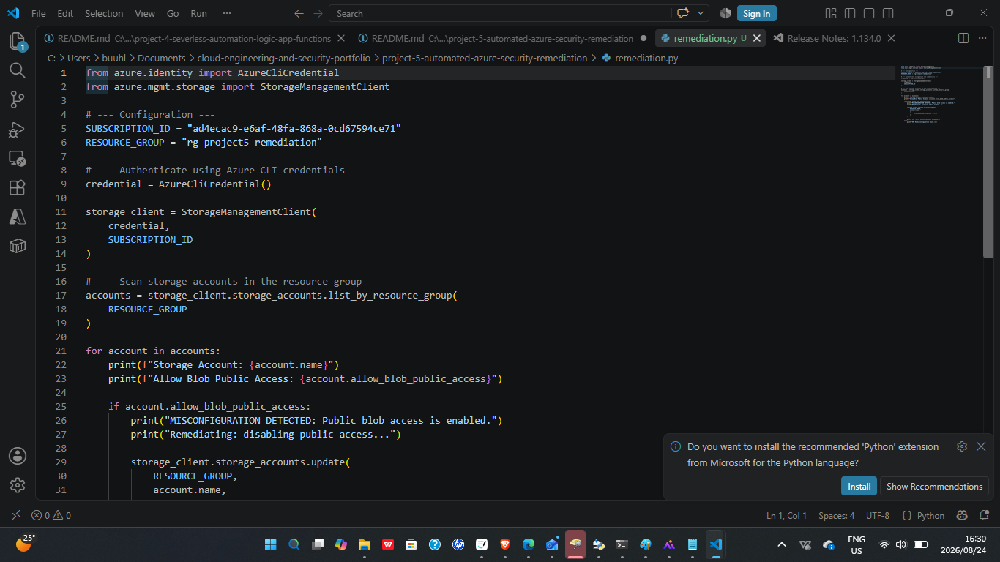
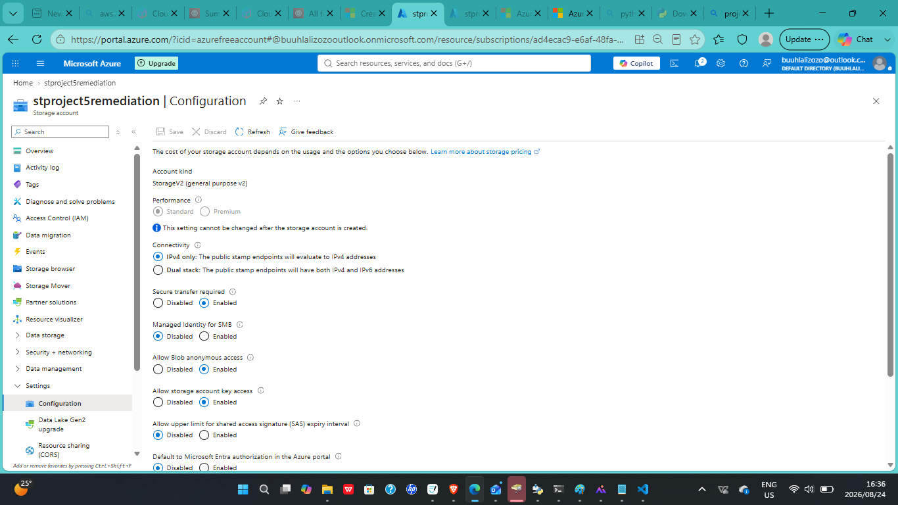
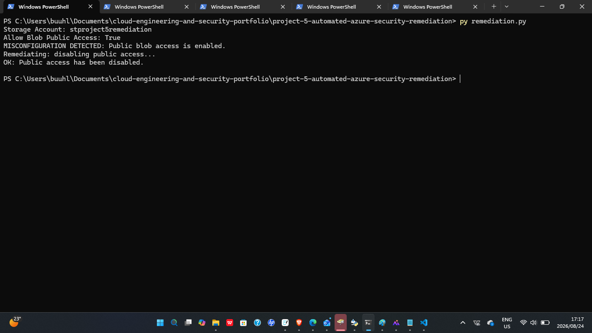
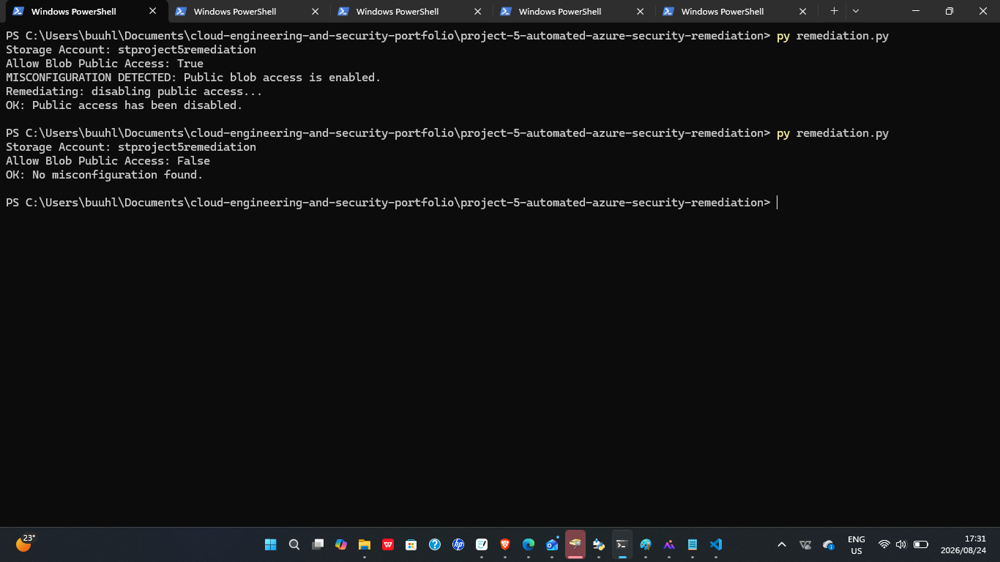
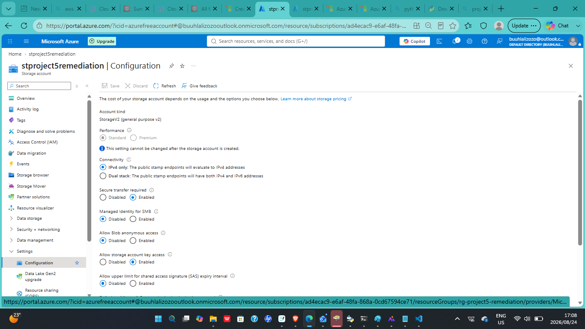

# 05 — Automated Azure Security Remediation with Python

## Overview

This project demonstrates **automated cloud security remediation** in Microsoft Azure using Python and the Azure SDK.

The solution scans Azure Storage Accounts within a specified resource group, checks whether public blob access is enabled, identifies insecure configurations, and automatically disables public blob access when a misconfiguration is detected.

The project was designed to demonstrate how cloud security checks and remediation actions can be automated rather than performed manually through the Azure Portal.

The goal was to build a lightweight security automation workflow that demonstrates **configuration assessment, misconfiguration detection, automated remediation, and secure cloud operations**.

---

## Technologies Used

- Microsoft Azure
- Python
- Azure SDK for Python
- Azure Identity
- Azure Storage Management SDK
- Azure CLI Authentication
- Azure Storage Accounts
- Azure Resource Groups
- Git
- GitHub

---

## Objectives

- Authenticate to Microsoft Azure using Python
- Connect to Azure resources using the Azure SDK
- Enumerate Storage Accounts within a resource group
- Inspect Storage Account security configuration
- Detect whether public blob access is enabled
- Identify insecure storage configurations
- Automatically disable public blob access
- Validate the remediation action
- Reduce reliance on manual security configuration
- Demonstrate cloud security automation using Python

---

## Cloud Security Automation

The project uses Python and the Azure SDK to perform automated configuration assessment and remediation.

Instead of manually opening each Storage Account in the Azure Portal and checking its public access configuration, the Python script performs the assessment programmatically.

The script:

- Authenticates to Azure
- Connects to the Azure Storage management API
- Retrieves Storage Accounts from the selected resource group
- Checks the `allow_blob_public_access` configuration
- Detects Storage Accounts with public access enabled
- Applies a remediation action
- Disables public blob access automatically
- Reports the remediation result

This approach demonstrates:

- Cloud security automation
- Configuration assessment
- Programmatic cloud management
- Automated remediation
- Secure configuration enforcement
- Python-based cloud operations
- Reduction of manual security tasks

---

## Automation Workflow

The security remediation workflow follows this sequence:

```text
Azure Authentication
        |
        v
Azure Storage Management Client
        |
        v
List Storage Accounts
        |
        v
Inspect Security Configuration
        |
        v
Check Public Blob Access
        |
        +----------------------+
        | |
        v v
 Public Access OFF Public Access ON
        | |
        v v
 Configuration OK Misconfiguration Detected
                               |
                               v
                     Automated Remediation
                               |
                               v
                  Disable Public Blob Access
                               |
                               v
                      Confirm Remediation
```

### Workflow Purpose

- **Azure Authentication** — authenticates the script to the Azure environment
- **Storage Management Client** — provides programmatic access to Azure Storage management operations
- **List Storage Accounts** — retrieves Storage Accounts within the target resource group
- **Configuration Inspection** — checks the current public blob access setting
- **Misconfiguration Detection** — identifies Storage Accounts with public access enabled
- **Automated Remediation** — updates the insecure Storage Account configuration
- **Validation** — confirms that the security setting has been changed

---

## Architecture

The architecture uses Python and Azure management APIs to create an automated security remediation pipeline.

```text
                     Python Script
                          |
                          v
                 Azure CLI Credential
                          |
                          v
                  Azure Identity
                          |
                          v
             Storage Management Client
                          |
                          v
                 Azure Resource Group
                          |
                          v
                Azure Storage Accounts
                          |
                          v
              Configuration Assessment
                          |
                 +--------+--------+
                 | |
                 v v
          Secure Setting Public Access
             Detected Enabled
                 | |
                 v v
            No Action Security Finding
                                   |
                                   v
                         Automated Remediation
                                   |
                                   v
                     Disable Public Blob Access
                                   |
                                   v
                            Secure State
```

### Architecture Components

- **Python Script** — contains the detection and remediation logic
- **Azure CLI Credential** — authenticates the script using the active Azure CLI session
- **Azure Identity** — provides authentication support for Azure SDK operations
- **Storage Management Client** — manages and retrieves Azure Storage Account configuration
- **Azure Resource Group** — defines the scope containing the target Storage Accounts
- **Azure Storage Accounts** — resources assessed for insecure public access
- **Configuration Assessment** — evaluates the `allow_blob_public_access` setting
- **Security Finding** — represents a detected insecure configuration
- **Automated Remediation** — updates the Storage Account configuration programmatically
- **Secure State** — represents the Storage Account after public blob access has been disabled

---

## Authentication

The script uses Azure CLI authentication through:

```python
AzureCliCredential()
```

This allows the Python application to authenticate using the Azure account currently signed in through the Azure CLI.

The authenticated credential is then passed to the Azure Storage Management Client.

Example:

```python
credential = AzureCliCredential()

storage_client = StorageManagementClient(
    credential,
    subscription_id
)
```

This allows the script to communicate securely with Azure management APIs.

---

## Storage Account Discovery

The script retrieves Storage Accounts from the configured Azure Resource Group.

```python
accounts = storage_client.storage_accounts.list_by_resource_group(
    RESOURCE_GROUP
)
```

Each Storage Account is then inspected individually.

This allows the security check to scale across multiple Storage Accounts rather than requiring manual inspection of each resource.

---

## Misconfiguration Detection

For each Storage Account, the script checks the public blob access configuration.

```python
public_access = account.allow_blob_public_access
```

The script evaluates whether public access has been enabled.

If public blob access is disabled, the Storage Account is considered compliant with this specific security check.

If public blob access is enabled, the script identifies the resource as requiring remediation.

### Detection Logic

```text
Storage Account
      |
      v
Check allow_blob_public_access
      |
      +-------------------+
      | |
      v v
   False True
      | |
      v v
 Configuration OK Misconfiguration
                          |
                          v
                     Remediation
```

---

## Automated Remediation

When public blob access is detected, the script automatically updates the Storage Account configuration using the Azure SDK's `StorageAccountUpdateParameters` model.

```python
from azure.mgmt.storage.models import StorageAccountUpdateParameters

storage_client.storage_accounts.update(
    RESOURCE_GROUP,
    account.name,
    StorageAccountUpdateParameters(
        allow_blob_public_access=False
    )
)
```

The remediation changes:

```text
allow_blob_public_access = True
```

to:

```text
allow_blob_public_access = False
```

This removes the insecure public access configuration without requiring manual intervention through the Azure Portal.

The remediation demonstrates how cloud security controls can be enforced programmatically.

---

## Security Scenario

Public blob access can expose Azure Storage data if it is enabled without a valid business requirement.

An incorrectly configured Storage Account may allow data to become publicly accessible.

Potential risks include:

- Unauthorized access to stored data
- Accidental data exposure
- Sensitive information disclosure
- Increased attack surface
- Cloud configuration drift
- Non-compliance with security policies

This project focuses specifically on detecting and remediating that configuration risk.

---

## Security Controls Demonstrated

The project demonstrates practical understanding of:

- Azure Storage security
- Public access configuration
- Cloud configuration assessment
- Automated security remediation
- Secure resource configuration
- Programmatic security enforcement
- Python cloud automation
- Azure authentication
- Configuration drift detection
- Cloud security operations

---

## Validation

The remediation workflow was validated end-to-end by confirming the Storage Account configuration before and after execution.

Validation included:

- Authenticating successfully to Azure
- Retrieving the target Storage Account
- Displaying the current public blob access setting
- Detecting the Storage Account with public access enabled
- Executing the remediation action
- Disabling public blob access
- Confirming successful remediation via a second script run
- Reviewing the updated configuration directly in the Azure Portal

### Detection Output

```text
Storage Account: stproject5remediation
Allow Blob Public Access: True

MISCONFIGURATION DETECTED: Public blob access is enabled.
Remediating: disabling public access...
OK: Public access has been disabled.
```

### Post-Remediation Validation Output

```text
Storage Account: stproject5remediation
Allow Blob Public Access: False
OK: No misconfiguration found.
```

The fix was also independently confirmed in the Azure Portal, where "Allow Blob anonymous access" showed **Disabled**.

---

## Troubleshooting

During implementation and testing, issues can be investigated by reviewing:

- Azure CLI authentication
- Subscription ID configuration
- Resource Group configuration
- Storage Account permissions
- Azure RBAC permissions
- Python dependencies
- Azure SDK installation
- Storage Management Client initialization
- API errors
- Resource names
- Public access configuration
- Python exception output

Common authentication issues can be checked by confirming the active Azure CLI session:

```bash
az account show
```

If required, authentication can be refreshed using:

```bash
az login
```

One issue encountered during development: newer versions of the Azure Storage SDK reject a plain dictionary passed to `storage_accounts.update()`, raising an `HttpResponseError` (`InvalidRequestContent`). This was resolved by passing a `StorageAccountUpdateParameters` object instead of a raw dict.

---

## Dependencies

The project requires the Azure SDK packages used by the Python remediation script.

Example dependencies include:

```text
azure-identity
azure-mgmt-storage
```

These dependencies should be stored in:

```text
requirements.txt
```

and can be installed using:

```bash
pip install -r requirements.txt
```

---

## Screenshots

### Python Remediation Script





### Public Blob Access Configuration





### Misconfiguration Detection





### Automated Remediation





### Secure Configuration Validation





---

## Skills Demonstrated

- Microsoft Azure
- Python
- Azure SDK for Python
- Azure Identity
- Azure Storage Management
- Cloud Security
- Security Automation
- Automated Remediation
- Configuration Assessment
- Azure Authentication
- Programmatic Cloud Management
- Secure Cloud Storage
- Cloud Misconfiguration Detection
- Azure Resource Management
- Troubleshooting
- Testing and Validation
- Technical Documentation

---

## Key Engineering & Security Concepts

- Cloud security automation
- Automated remediation
- Configuration drift detection
- Secure-by-default configuration
- Programmatic cloud management
- Azure API integration
- Infrastructure security
- Public access control
- Cloud configuration assessment
- Python automation
- Security control enforcement
- Continuous security validation

---

## Repository Structure

```text
project-5-automated-azure-security-remediation/
├── README.md
├── remediation.py
├── requirements.txt
└── screenshots/
```

---

## Future Improvements

Potential future improvements include:

- Run the remediation script as an Azure Function
- Add a scheduled Timer Trigger
- Add Azure Monitor integration
- Generate alerts before remediation
- Add Microsoft Sentinel integration
- Add email or Teams notifications
- Store configuration values securely in Azure Key Vault
- Use Managed Identity instead of local Azure CLI authentication
- Add logging and audit records
- Add dry-run mode before applying remediation
- Scan multiple Azure subscriptions
- Add additional Storage Account security checks
- Add automated remediation for other Azure resources
- Deploy the automation using Terraform
- Integrate the security check into a CI/CD pipeline
